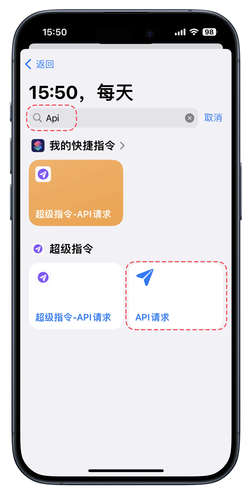

1. 如何导入 cURL 到 AppName

2. AppStore 下载抓包软件 Stream（点我）

3. 点击开始抓包，抓包完成后停止抓包，再点击抓包历史

4. 在历史记录中点击刚刚抓包的记录

5. 找到自己所需要的请求，可按域名或进程查找

6. 点击右上角分享按钮

7. 点击获取 cURL 命令

8. 点击右上角分享按钮（导出/分享）

9. 点击导入到 AppName

10. 导入成功后可点击进入详情

11. 点击右上角运行按钮进行 API 请求

12. 点击响应状态查看该请求的所有日志

13. 该请求的所有日志记录
